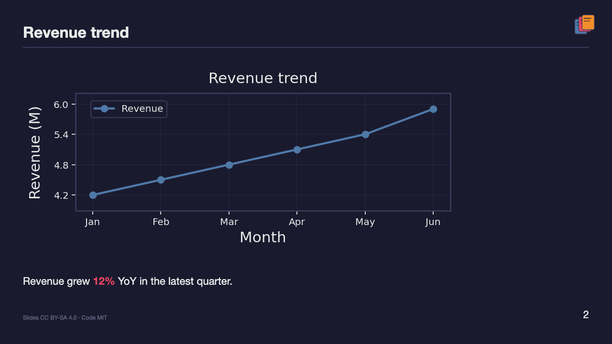
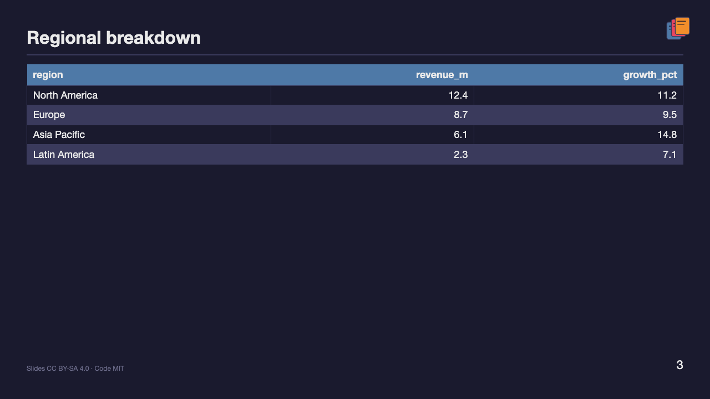
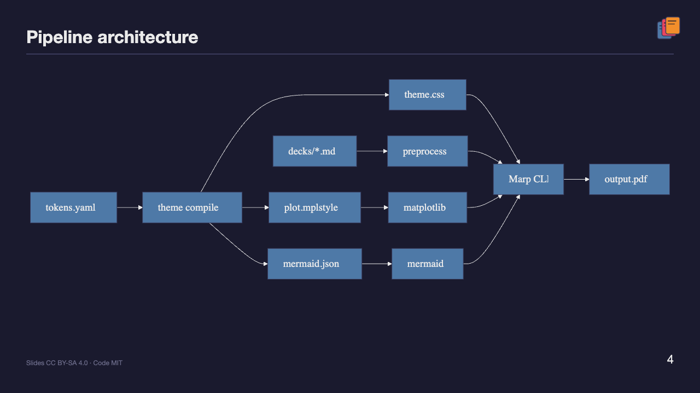

<p align="center">
  
</p>

# ppt-gen

Unified design-system layer for [Marp](https://marp.app/) decks. One `tokens.yaml` drives Marpit CSS, matplotlib plots, Mermaid diagrams, and tables.

The logo is generated from theme colors when you compile a theme (`ppt_gen/brand.py`) and appears on every slide.

## Example

The [quarterly-report](decks/quarterly-report.md) deck shows what one `tokens.yaml` can produce: themed matplotlib charts, pandas tables, and Mermaid diagrams in a single PDF.

**[Download quarterly-report.pdf](examples/quarterly-report.pdf)** · [Source markdown](decks/quarterly-report.md)

| Revenue trend | Regional breakdown | Pipeline architecture |
| :---: | :---: | :---: |
|  |  |  |

## Requirements

- Python 3.10+
- Node.js 18+ (for Marp CLI)
- Chrome, Edge, or Firefox (required by Marp CLI for PDF/PPTX export)

## Quick start

```bash
# Python dependencies
pip install -e .

# Node dependencies (Marp CLI + Mermaid CLI for diagram rendering)
npm install

# Compile theme from tokens
python -m ppt_gen.theme compile scientific

# Build example deck (preprocess + PDF)
python -m ppt_gen.build all quarterly-report
```

Output: `output/quarterly-report.pdf` (a committed copy lives in `examples/`)

## Workflow

1. Edit `themes/scientific/tokens.yaml` for colors, fonts, layout, and branding
2. Run `python -m ppt_gen.theme compile scientific`
3. Author slides in `decks/*.md` with directives:
   - `{{plot:revenue_trend}}`
   - `{{table:regions | max_rows=8}}`
   - `{{mermaid:architecture}}`
4. Run `python -m ppt_gen.build all <deck-name>`

Slides get a top-right logo and a license footer from `branding` in `tokens.yaml` (injected at preprocess time unless the deck sets its own `footer:`).

## Project layout

```
themes/scientific/tokens.yaml   # single source of truth
assets/brand/logo.svg           # generated project logo
decks/quarterly-report.md       # slide source
examples/quarterly-report.pdf   # built example for README / demos
plots/revenue_trend.py          # registered plot functions
data/                           # CSV data for tables/plots
ppt_gen/                        # preprocessor + theme compiler
```

## New theme

```bash
cp -r themes/scientific themes/acme
# edit themes/acme/tokens.yaml
python -m ppt_gen.theme compile acme
```

Set `theme: acme` in deck frontmatter.

## License

- **Code:** [MIT](LICENSE)
- **Slide decks:** [CC BY-SA 4.0](decks/SLIDES_LICENSE)
