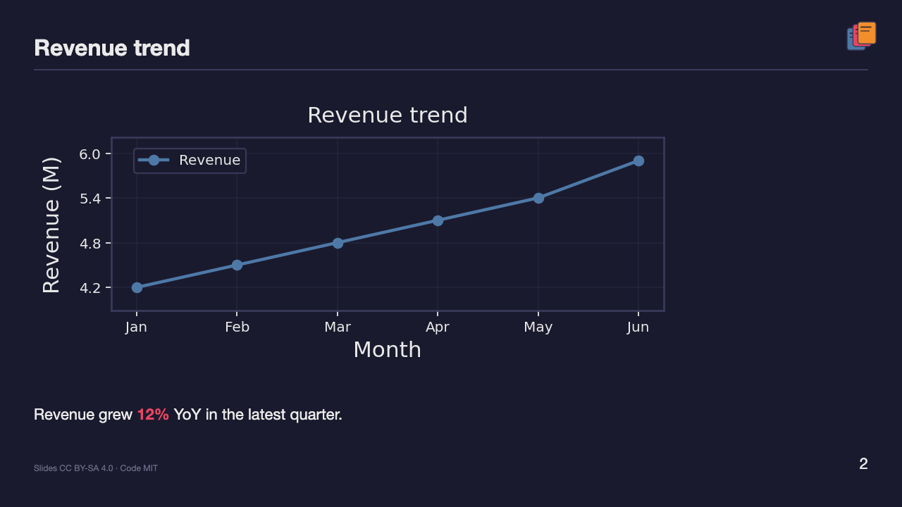
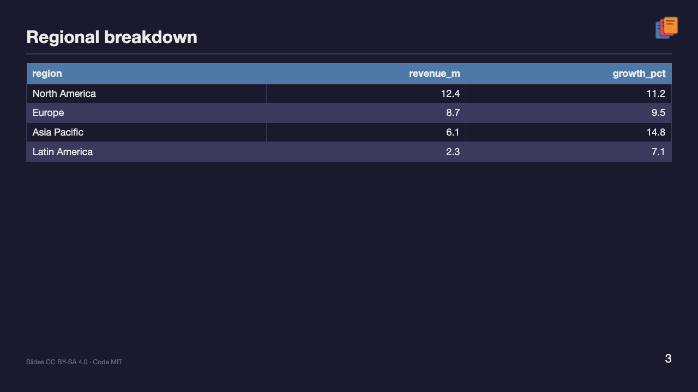
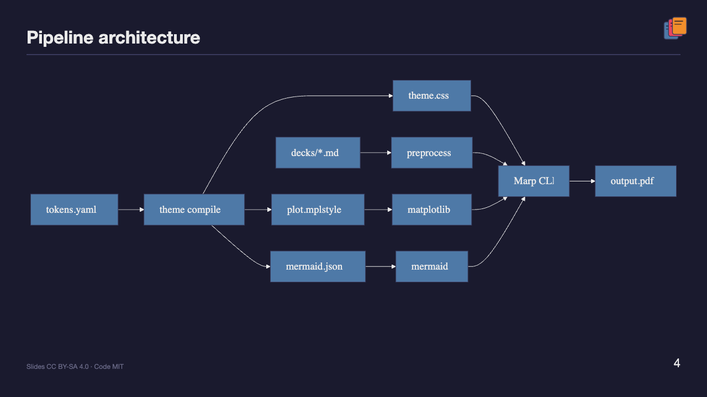

<p align="center">
  
</p>

# ppt-gen

Unified design-system layer for [Marp](https://marp.app/) decks. One `tokens.yaml` drives Marpit CSS, Chart.js plots, Mermaid diagrams, and tables.

The CLI is **Node ESM** (`bin/ppt-gen.mjs`): Chart.js for plots, CSV → markdown/PPTX tables, Mermaid CLI for diagrams, pptxgenjs for visual constructs.

The logo is generated from theme colors when you compile a theme (`lib/brand.mjs`) and appears on every slide.

## Example

The [demo](decks/demo.md) deck is the single source example: Q1 charts/tables/diagrams plus the product-data roadmap constructs.

**[Download demo.pptx](examples/demo.pptx)** · [Source markdown](decks/demo.md)

| Revenue trend | Regional breakdown | Pipeline architecture |
| :---: | :---: | :---: |
|  |  |  |

## Visual constructs (shared markdown)

Roadmap / idea slides use the **same Markdown file** as data slides, with fenced construct blocks:

````markdown
---
theme: scientific
engine: auto          # auto | marp | constructs
title: Product data roadmap
footerLabel: "PRODUCT  ·  DATA ROADMAP"
---

::: construct roadmapPhases
title: Sequence the roadmap
phases:
  - k: 0–90 DAYS
    name: Prove the signal
    color: coral
    outs: [MVP, Baseline]
:::
````

- `engine: auto` (default) → **pptxgenjs** if any `::: construct` blocks exist, else **Marp**
- `{{plot}}` / `{{table}}` / `{{mermaid}}` expand on both engines (PPTX embeds images/tables)
- Color names in YAML (`coral`, `blue`, `cyan`, `lime`, `series.0`, …) resolve from scientific tokens

```bash
npm run build:constructs
# or: node bin/ppt-gen.mjs all decks/demo.md
```

Output: [`examples/demo.pptx`](examples/demo.pptx) · source [`decks/demo.md`](decks/demo.md)

Helpers: `lib/constructs/` · IR parser: `lib/ir/`

## Requirements

- Node.js 18+
- Chrome, Edge, or Firefox (required by Marp CLI for PDF/PPTX export)

## Quick start

```bash
npm install

# Compile theme from tokens
npm run theme:compile

# Build example deck (Marp PDF — constructs as markdown fallbacks)
npm run build:pdf

# Build full hybrid PPTX (plots + constructs)
npm run build:constructs
```

Or: `node bin/ppt-gen.mjs all decks/demo.md`

Output: `output/demo.pptx` (a committed copy lives in `examples/`)

## Workflow

1. Edit `themes/scientific/tokens.yaml` for colors, fonts, layout, and branding
2. Run `npm run theme:compile`
3. Author slides in `decks/*.md` with directives:
   - `{{plot:quarterly | type=line | x=month | y=revenue_m}}` — Chart.js from `data/*.csv`
   - `{{table:regions | max_rows=8}}`
   - `{{mermaid:architecture}}`
4. Run `npm run build:pdf` (or `node bin/ppt-gen.mjs all <deck-name>`)

Slides get a top-right logo and a license footer from `branding` in `tokens.yaml` (injected at preprocess time unless the deck sets its own `footer:`).

## Project layout

```
themes/scientific/tokens.yaml   # single source of truth
assets/brand/logo.svg           # generated project logo
decks/demo.md                   # Q1 data + roadmap constructs (single source)
lib/ir/                         # markdown → IR → marp | pptxgenjs
lib/constructs/                 # box/chip/roadmap/… helpers
examples/                       # committed PDF / PPTX demos
data/*.csv                      # plot + table sources ({{plot:name}} / {{table:name}})
bin/ppt-gen.mjs                 # CLI entry
lib/                            # theme compile, preprocess, build, constructs
```

## New theme

```bash
cp -r themes/scientific themes/acme
# edit themes/acme/tokens.yaml
node bin/ppt-gen.mjs compile-themes
```

Set `theme: acme` in deck frontmatter.

## License

- **Code:** [MIT](LICENSE)
- **Slide decks:** [CC BY-SA 4.0](decks/SLIDES_LICENSE)
