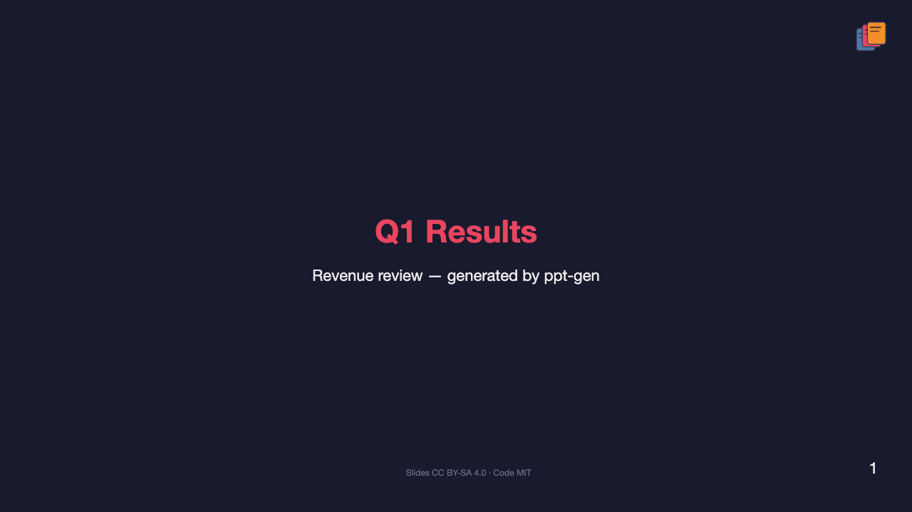

# One YAML File to Rule Your Slides: Building a Design System for Markdown Presentations

*Markdown slides, Python charts, one YAML design system — no PowerPoint required.*


---

Most presentation tools ask you to choose between two bad options.

Option one: click through a GUI until the chart colors almost match the slide background. Option two: export a matplotlib figure, paste it into Keynote, resize it by eye, and hope nobody notices the font is wrong.

If you work with data — quarterly reviews, architecture walkthroughs, research updates — you have probably lived this. The slide deck is the deliverable everyone sees. The notebook or script that produced the numbers is the source of truth. And nothing connects them.

I built **ppt-gen** to close that gap: markdown slides you can edit by hand, programmatic charts and tables from real data, and one design token file that keeps everything visually consistent.

---

## What I was trying to solve

I wanted a pipeline with a few non-negotiable properties:

1. **Editable source** — slides as text, version-controlled, diffable
2. **Programmatic assets** — plots and tables generated from CSVs and Python, not screenshots
3. **One visual language** — the same accent color on a line chart, a table header, and a Mermaid box
4. **Sensible output** — PDF is fine; I do not need a live animation runtime

I explicitly did *not* want:

- `python-pptx` choreography (layout XML by hand)
- Quarto or notebook-to-slide magic that hides the slide layer
- A WYSIWYG tool that breaks the moment you regenerate a chart

[Marp](https://marp.app/) was the right foundation: Markdown in, PDF out, themeable with CSS. What Marp does not give you out of the box is a bridge to matplotlib, pandas, and Mermaid that shares a single design system. That is what ppt-gen adds.

---

## The core idea: design tokens, not slide styling

Design systems in web apps use tokens — named values for color, type, spacing — compiled into CSS. ppt-gen applies the same pattern to presentations.

Everything starts in `themes/scientific/tokens.yaml`:

```yaml
colors:
  background: "#1a1a2e"
  foreground: "#eaeaea"
  accent: "#e94560"
  series:
    - "#4e79a7"
    - "#f28e2b"
    - "#e15759"

typography:
  slide:
    title_px: 44
    heading_px: 32
    body_px: 22
  plot:
    tick_pt: 9
    legend_pt: 9

branding:
  footer: "Slides CC BY-SA 4.0 · Code MIT"
```

Run `python -m ppt_gen.theme compile scientific` and that one file becomes:

- **Marp CSS** — slide layout, typography, table styles, logo placement
- **matplotlib style** — `.mplstyle` with matching colors and font sizes
- **Mermaid config** — `themeVariables` for diagram rendering

Change the accent from coral to blue, recompile, rebuild the deck. Every surface updates together. No hunting through three tools.

---

## Authoring slides: Markdown plus three directives

A deck is ordinary Marp markdown with small placeholders where assets belong:

```markdown
---
marp: true
theme: scientific
paginate: true
title: Q1 Results
---

# Q1 Results
Revenue review — generated by ppt-gen

---

## Revenue trend

{{plot:revenue_trend}}

Revenue grew **12%** YoY in the latest quarter.

---

## Regional breakdown

{{table:regions | max_rows=8}}

---

## Pipeline architecture

{{mermaid:architecture}}
```

That is the entire author-facing API:

| Directive | What it does |
|-----------|--------------|
| `{{plot:name}}` | Runs a registered Python plot function, saves a PNG |
| `{{table:name}}` | Renders a pandas DataFrame as a styled markdown table |
| `{{mermaid:name}}` | Pre-renders a `.mmd` file to SVG via Mermaid CLI |

The preprocessor expands these before Marp runs. You never hand-maintain image paths or worry about stale charts.

---

## Plots that know about slide geometry

Each plot is a small Python function registered by name:

```python
@register("revenue_trend")
def render(ctx: SlideContext):
    fig, ax = ctx.figure()
    df = ctx.data.get("quarterly")
    ax.plot(df["month"], df["revenue_m"], color=ctx.color(0), marker="o")
    ax.set_title("Revenue trend")
    ax.set_ylabel("Revenue (M)")
    finalize_line_chart(fig, ax, ctx.tokens, legend_position="upper-left")
    return fig
```

`SlideContext` reads the same tokens as the slide theme: figure size comes from layout slots (`full`, `half`, `square`), colors from the series palette, fonts from the plot typography block. The chart is sized for a 1280×720 slide at 85% width — not a generic notebook figure you shrink in PowerPoint.

Caching is content-addressed: if the plot source, data shape, or tokens have not changed, the PNG is reused. Iterating on slide copy stays fast.

---

## One build command

```bash
pip install -e .
npm install
python -m ppt_gen.build all quarterly-report
```

Under the hood:

1. **Compile themes** — `tokens.yaml` → CSS, mplstyle, mermaid.json, generated logo
2. **Preprocess** — expand directives, inject license footer from branding tokens
3. **Render** — Marp CLI produces `output/quarterly-report.pdf`

The deck source stays in `decks/quarterly-report.md`. Generated assets land in `assets/plots/`, `assets/diagrams/`, and a build cache. Git ignores the churn; the markdown and tokens are what you commit.

---

## What the output looks like

The example quarterly report deck includes:

- A **title slide** with generated branding (logo derived from theme colors)
- A **revenue line chart** from `data/quarterly.csv`
- A **regional breakdown table** from `data/regions.csv`
- An **architecture diagram** from `mermaid/architecture.mmd`
- A **license footer** on every slide (CC BY-SA for decks, MIT for code)

Download the [full PDF](../examples/quarterly-report.pdf) or read the [source markdown](../decks/quarterly-report.md). Three slides from the same build:

| Revenue trend | Regional breakdown | Pipeline architecture |
| :---: | :---: | :---: |
|  |  |  |

The title slide and summary use the same theme, logo, and license footer — only the body content changes.



---

## Details that matter in practice

**Title slides vs. content slides.** Content slides top-align titles like PowerPoint section headers. Title slides stay vertically centered. That came down to Marp theme CSS — flex layout, `place-content: start`, and a `@theme` directive that must be on its own line (a subtle gotcha that caused the default theme to load instead of yours).

**Logo without broken paths.** The generated SVG is embedded in theme CSS as a data URI so Marp does not need to resolve relative file paths at render time.

**Offline diagrams.** Mermaid is pre-rendered with `@mermaid-js/mermaid-cli`, themed from the same tokens. No live JS in the PDF.

**New themes in minutes.** Copy `themes/scientific` to `themes/acme`, edit `tokens.yaml`, compile, set `theme: acme` in frontmatter.

---

## Who this is for

ppt-gen fits if you:

- Already live in Markdown, Python, and git
- Ship recurring decks (quarterly metrics, eng reviews, course material)
- Care that charts and slides look like they came from the same template
- Want PDF output without maintaining a `.pptx` by hand

It is probably not for you if you need slide transitions, embedded video, or a non-technical co-author who will only touch PowerPoint.

---

## What I would do next

A few natural extensions:

- HTML slide output with the same pipeline
- More plot types in the registry (bar, scatter, small multiples)
- CI that rebuilds example decks on every PR
- A `tokens.yaml` linter that catches contrast and font-size issues before render

The architecture is intentionally boring: tokens compile to artifacts, a preprocessor expands directives, Marp renders. Boring pipelines are easy to extend.

---

## Try it

```bash
git clone https://github.com/dhanesh123in/ppt-gen.git
cd ppt-gen
pip install -e .
npm install
python -m ppt_gen.build all quarterly-report
open output/quarterly-report.pdf
```

Source and examples: [github.com/dhanesh123in/ppt-gen](https://github.com/dhanesh123in/ppt-gen)

Code is [MIT](../LICENSE). Slide content is [CC BY-SA 4.0](../decks/SLIDES_LICENSE).

If you have fought the copy-paste chart workflow, this might be the presentation layer you wanted sitting next to your data scripts all along.

---

*Questions or ideas? [Open an issue](https://github.com/dhanesh123in/ppt-gen/issues) or adapt the tokens for your own brand. The quarterly report is meant to be forked, not admired from a distance.*
