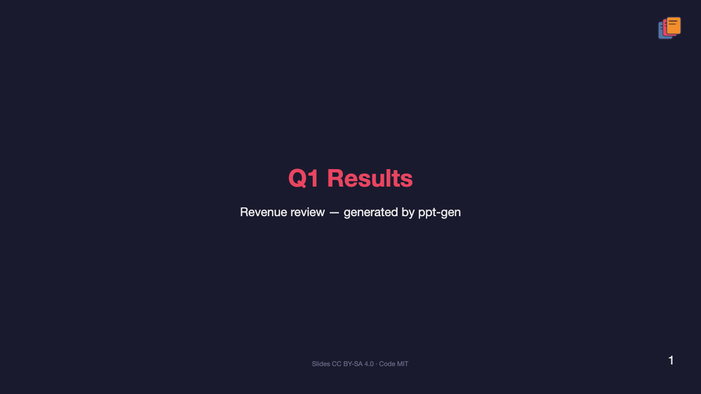

# One YAML File to Rule Your Slides: Building a Design System for Markdown Presentations

*Markdown slides, Chart.js plots, one YAML design system — no PowerPoint required.*


---

Most presentation tools ask you to choose between two bad options.

Option one: click through a GUI until the chart colors almost match the slide background. Option two: export a matplotlib figure, paste it into Keynote, resize it by eye, and hope nobody notices the font is wrong.

If you work with data — quarterly reviews, architecture walkthroughs, research updates — you have probably lived this. The slide deck is the deliverable everyone sees. The notebook or script that produced the numbers is the source of truth. And nothing connects them.

I built **ppt-gen** to close that gap: markdown slides you can edit by hand, programmatic charts and tables from real data, and one design token file that keeps everything visually consistent. The build CLI is Node ESM (`bin/ppt-gen.mjs`); plots use Chart.js.

---

## What I was trying to solve

I wanted a pipeline with a few non-negotiable properties:

1. **Editable source** — slides as text, version-controlled, diffable
2. **Programmatic assets** — plots and tables generated from CSVs and scripts, not screenshots
3. **One visual language** — the same accent color on a line chart, a table header, and a Mermaid box
4. **Sensible output** — PDF is fine; I do not need a live animation runtime

I explicitly did *not* want:

- `python-pptx` choreography (layout XML by hand)
- Quarto or notebook-to-slide magic that hides the slide layer
- A WYSIWYG tool that breaks the moment you regenerate a chart

[Marp](https://marp.app/) was the right foundation: Markdown in, PDF out, themeable with CSS. What Marp does not give you out of the box is a bridge to Chart.js, CSV tables, and Mermaid that shares a single design system. That is what ppt-gen adds.

---

## The core idea: design tokens, not slide styling

Design systems in web apps use tokens — named values for color, type, spacing — compiled into CSS. ppt-gen applies the same pattern to presentations.

Everything starts in `themes/scientific/tokens.yaml`:

```yaml
colors:
  background: "#1a1a2e"
  foreground: "#eaeaea"
  accent: "#e94560"
  series:
    - "#4e79a7"
    - "#f28e2b"
    - "#e15759"

typography:
  slide:
    title_px: 44
    heading_px: 32
    body_px: 22
  plot:
    tick_pt: 16
    legend_pt: 16

branding:
  footer: "Slides CC BY-SA 4.0 · Code MIT"
```

Run `npm run theme:compile` and that one file becomes:

- **Marp CSS** — slide layout, typography, table styles, logo placement
- **Chart defaults** — series colors, fonts, and canvas size for Chart.js plots
- **Mermaid config** — `themeVariables` for diagram rendering

Change the accent from coral to blue, recompile, rebuild the deck. Every surface updates together. No hunting through three tools.

---

## Authoring slides: Markdown plus directives and layouts

A deck is ordinary Marp markdown with small placeholders where assets belong:

```markdown
---
marp: true
theme: scientific
engine: auto
paginate: true
title: Q1 Results
---

# Q1 Results
Revenue review — generated by ppt-gen

---

## Revenue trend

{{plot:quarterly | type=line | x=month | y=revenue_m}}

Revenue grew **12%** YoY in the latest quarter.

---

## Regional breakdown

{{table:regions | max_rows=8}}

---

## Pipeline architecture

{{mermaid:architecture}}
```

That is the data / diagram surface:

| Directive | What it does |
|-----------|--------------|
| `{{plot:name \| type=line\|bar \| x=… \| y=…}}` | Chart.js PNG from `data/<name>.csv` |
| `{{table:name}}` | Renders CSV rows as a styled markdown table |
| `{{mermaid:name}}` | Pre-renders a `.mmd` file to PNG/SVG via Mermaid CLI |
| `$$…$$` / `$…$` | KaTeX → PNG (Chrome screenshot) |

For argument / org / KPI slides, use fenced `::: layout <name>` blocks (roadmap, matrix2x2, big-number, hierarchy, equation, …). With `engine: auto`, those decks render through **pptxgenjs**; plain Marp markdown still works for content-only decks.

The preprocessor expands directives before Marp or the constructs engine runs. You never hand-maintain image paths or worry about stale charts.

---

## Plots that know about slide geometry

CSV columns become charts without a hand-written Chart.js module for every series:

```markdown
{{plot:quarterly | type=line | x=month | y=revenue_m}}
{{plot:regions | type=bar | x=region | y=revenue_m | slot=half}}
```

`SlideContext` reads the same tokens as the slide theme: figure size comes from layout slots (`full`, `half`, `square`), colors from the series palette, fonts from the plot typography block. Charts keep a readable ~2.2:1 aspect and are contain-fitted on the slide so labels stay legible.

Caching is content-addressed: if the CSV, options, or tokens have not changed, the PNG is reused. Iterating on slide copy stays fast.

---

## One build command

```bash
npm install
npm run theme:compile
npm run build:constructs
```

```bash
node bin/ppt-gen.mjs all decks/demo.md
node bin/ppt-gen.mjs constructs decks/examples/chat-product.md
```

Under the hood:

1. **Compile themes** — `tokens.yaml` → CSS, mermaid.json, generated logo
2. **Preprocess** — expand directives, inject license footer from branding tokens
3. **Render** — pptxgenjs layouts (constructs) and/or Marp CLI → `output/*.pptx` / `.pdf`

The deck source stays in `decks/`. Generated assets land in `assets/plots/`, `assets/diagrams/`, `assets/math/`, and a build cache (all gitignored). The markdown and tokens are what you commit.

---

## What the output looks like

The [demo](../decks/demo.md) deck includes:

- A **cover** layout with a themed RHS panel
- **Charts and tables** from `data/*.csv`
- An **architecture diagram** from `mermaid/architecture.mmd`
- **Roadmap / matrix / swimlane** argument layouts via `::: layout`
- Display **equations** via KaTeX
- A **license footer** on every slide (CC BY-SA for decks, MIT for code)

Download [demo.pptx](../examples/demo.pptx) or browse more examples under [`decks/examples/`](../decks/examples/) (chat product, MoE LLMs, apparel markdown). Preview frames from an earlier quarterly build:

| Title | Revenue trend |
| :---: | :---: |
|  |  |

Also available: [quarterly-report.pdf](../examples/quarterly-report.pdf).

---

## Details that matter in practice

**Title slides vs. content slides.** Content slides top-align titles like PowerPoint section headers. Title slides stay vertically centered. That came down to Marp theme CSS — flex layout, `place-content: start`, and a `@theme` directive that must be on its own line (a subtle gotcha that caused the default theme to load instead of yours).

**Logo without broken paths.** Drop a custom SVG/PNG in `assets/brand/` (or set `branding.logo` / frontmatter `logo:`). The file is embedded in Marp CSS as a data URI and painted on pptxgenjs slides; omit it to keep the generated mark.

**Offline diagrams.** Mermaid is pre-rendered with `@mermaid-js/mermaid-cli`, themed from the same tokens. No live JS in the PDF.

**New themes in minutes.** Copy `themes/scientific` (or `themes/light`) to `themes/acme`, edit `tokens.yaml`, compile, set `theme: acme` in frontmatter. Decks can also override `colors` / `typography` / `space` inline.

---

## Who this is for

ppt-gen fits if you:

- Already live in Markdown, JavaScript/Node, and git
- Ship recurring decks (quarterly metrics, eng reviews, course material)
- Care that charts and slides look like they came from the same template
- Want PDF output without maintaining a `.pptx` by hand

It is probably not for you if you need slide transitions, embedded video, or a non-technical co-author who will only touch PowerPoint.

---

## What I would do next

A few natural extensions:

- More layout plugins (and a small authoring guide per layout)
- CI that rebuilds example decks on every PR
- A `tokens.yaml` linter that catches contrast and font-size issues before render
- Stronger equation cropping / DPI options for print

The architecture is intentionally boring: tokens compile to artifacts, a preprocessor expands directives, Marp or pptxgenjs renders. Boring pipelines are easy to extend.

---

## Try it

```bash
git clone https://github.com/dhanesh123in/ppt-gen.git
cd ppt-gen
npm install
npm run theme:compile
npm run build:constructs
open output/demo.pptx
```

Source and examples: [github.com/dhanesh123in/ppt-gen](https://github.com/dhanesh123in/ppt-gen)

Code is [MIT](../LICENSE). Slide content is [CC BY-SA 4.0](../decks/SLIDES_LICENSE).

If you have fought the copy-paste chart workflow, this might be the presentation layer you wanted sitting next to your data scripts all along.

---

*Questions or ideas? [Open an issue](https://github.com/dhanesh123in/ppt-gen/issues) or adapt the tokens for your own brand. The demo deck is meant to be forked, not admired from a distance.*
